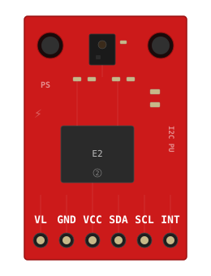
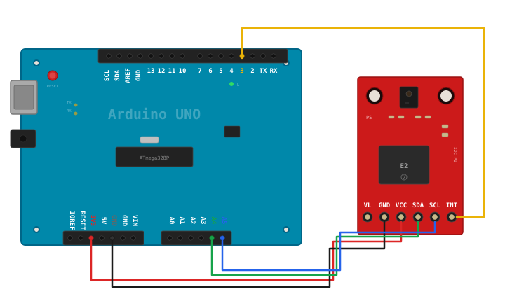

# APDS9960

This APDS9960 sensor is a basic gesture sensing, RGB color sensing, proximity sensing, or ambient light sensing.

## Board

# Wiring

## Pinout

| Pin | Description                                                                                                                                                                                                                                                                         |
|-----|-------------------------------------------------------------------------------------------------------------------------------------------------------------------------------------------------------------------------------------------------------------------------------------|
| Vin | this is the power pin. Since the sensor uses 3.3V, we have included an onboard voltage regulator that will take 3-5VDC and safely convert it down. To power the board, give it the same power as the logic level of your microcontroller - e.g. for a 5V micro like Arduino, use 5V |
| 3Vo | this is the 3.3V output from the voltage regulator, you can grab up to 100mA from this if you like                                                                                                                                                                                  |
| GND | common ground for power and logic                                                                                                                                                                                                                                                   |
| SCL | this is the I2C clock pin, connect to your microcontrollers I2C clock line. There is a 10K pullup on this pin and it is level shifted so you can use 3 - 5VDC.                                                                                                                      |
| SDA | this is the I2C data pin, connect to your microcontrollers I2C data line. There is a 10K pullup on this pin and it is level shifted so you can use 3 - 5VDC.                                                                                                                        |
| INT | this is the interrupt-output pin. It is 3V logic and you can use it to detect when a new reading is ready or when a reading gets too high or too low.                                                                                                                               |

## Description

This handy sensor is full of features! Add basic gesture sensing, RGB color sensing, proximity sensing, or ambient
light sensing to your project with the Adafruit APDS9960 Proximity, Light, RGB and Gesture Sensor. When connected to
your microcontroller (running our library code) it can detect simple gestures (left to right, right to left, up to down,
down to up are currently supported), return the amount of red, blue, green, and clear light, or return how close an
object is to the front of the sensor. This device uses an I2C interface so it's easy to wire up and use.

The APDS9960 from Avago Technologies has an integrated IR LED and driver, along with four directional photodiodes that
sense reflected IR energy from the LED. It's proximity detection feature allows it to measure the distance an object is
from the front of the sensor (up to a few centimeters) with 8 bit resolution.

Since there are four IR sensors, you can measure the changes in light reflectance at each of the cardinal locations over
time and turn those changes into gestures. Our interface library can detect directional gestures (left to right, right
to left, up to down, down to up), but in theory more complicated gestures like zig-zag, clockwise or counterclockwise
circle, near to far, etc. could also be detected with additional code.

The APDS9960 has a configurable interrupt that can fire when a certain proximity threshold is broken, or when a color
sensor breaks a certain threshold.

For your convenience we've pick-and-placed the sensor on a PCB with a 3.3V regulator and some level shifting so it can
be easily used with your favorite 3.3V or 5V microcontroller.

A ratio near 1.0 on a single channel means that colour dominates the scene.
